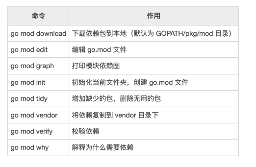

# Go Gin Example [](https://goreportcard.com/report/github.com/EDDYCJY/go-gin-example) [](https://godoc.org/github.com/EDDYCJY/go-gin-example) [](https://raw.githubusercontent.com/EDDYCJY/go-gin-example/master/LICENSE)

An example of gin contains many useful features

[简体中文](https://github.com/EDDYCJY/go-gin-example/blob/master/README_ZH.md)

## Installation
```
$ go get github.com/EDDYCJY/go-gin-example
```

## How to run

### Required

- Mysql
- Redis

### Ready

Create a **blog database** and import [SQL](https://github.com/EDDYCJY/go-gin-example/blob/master/docs/sql/blog.sql)

### Conf

You should modify `conf/app.ini`

```
[database]
Type = mysql
User = root
Password =
Host = 127.0.0.1:3306
Name = blog
TablePrefix = blog_

[redis]
Host = 127.0.0.1:6379
Password =
MaxIdle = 30
MaxActive = 30
IdleTimeout = 200
...
```

### Run
```
$ cd $GOPATH/src/go-gin-example

$ go run main.go 
```

Project information and existing API

```
[GIN-debug] [WARNING] Running in "debug" mode. Switch to "release" mode in production.
 - using env:	export GIN_MODE=release
 - using code:	gin.SetMode(gin.ReleaseMode)

[GIN-debug] GET    /auth                     --> github.com/EDDYCJY/go-gin-example/routers/api.GetAuth (3 handlers)
[GIN-debug] GET    /swagger/*any             --> github.com/EDDYCJY/go-gin-example/vendor/github.com/swaggo/gin-swagger.WrapHandler.func1 (3 handlers)
[GIN-debug] GET    /api/v1/tags              --> github.com/EDDYCJY/go-gin-example/routers/api/v1.GetTags (4 handlers)
[GIN-debug] POST   /api/v1/tags              --> github.com/EDDYCJY/go-gin-example/routers/api/v1.AddTag (4 handlers)
[GIN-debug] PUT    /api/v1/tags/:id          --> github.com/EDDYCJY/go-gin-example/routers/api/v1.EditTag (4 handlers)
[GIN-debug] DELETE /api/v1/tags/:id          --> github.com/EDDYCJY/go-gin-example/routers/api/v1.DeleteTag (4 handlers)
[GIN-debug] GET    /api/v1/articles          --> github.com/EDDYCJY/go-gin-example/routers/api/v1.GetArticles (4 handlers)
[GIN-debug] GET    /api/v1/articles/:id      --> github.com/EDDYCJY/go-gin-example/routers/api/v1.GetArticle (4 handlers)
[GIN-debug] POST   /api/v1/articles          --> github.com/EDDYCJY/go-gin-example/routers/api/v1.AddArticle (4 handlers)
[GIN-debug] PUT    /api/v1/articles/:id      --> github.com/EDDYCJY/go-gin-example/routers/api/v1.EditArticle (4 handlers)
[GIN-debug] DELETE /api/v1/articles/:id      --> github.com/EDDYCJY/go-gin-example/routers/api/v1.DeleteArticle (4 handlers)

Listening port is 8010
Actual pid is 4393
```
Swagger doc


## Features

- RESTful API
- Gorm
- Swagger
- logging
- Jwt-go
- Gin
- Graceful restart or stop (fvbock/endless)
- App configurable
- Cron
- Redis

### 生成go.mod
go mod init gin-example
### 依赖管理
go mod tidy




```azure
module github.com/EDDYCJY/go-gin-example

go 1.13

require (
	github.com/360EntSecGroup-Skylar/excelize v1.3.1-0.20180527032555-9e463b461434
	github.com/PuerkitoBio/purell v1.1.1-0.20180310210909-975f53781597 // indirect
	github.com/alecthomas/template v0.0.0-20190718012654-fb15b899a751
	github.com/astaxie/beego v1.9.3-0.20171218111859-f16688817aa4
	github.com/boombuler/barcode v1.0.1-0.20180315051053-3c06908149f7
	github.com/denisenkom/go-mssqldb v0.0.0-20190920000552-128d9f4ae1cd // indirect
	github.com/dgrijalva/jwt-go v3.1.0+incompatible
	github.com/erikstmartin/go-testdb v0.0.0-20160219214506-8d10e4a1bae5 // indirect
	github.com/gin-gonic/gin v1.4.0
	github.com/go-ini/ini v1.32.1-0.20180214101753-32e4be5f41bb
	github.com/go-sql-driver/mysql v1.4.1-0.20190510102335-877a9775f068 // indirect
	github.com/golang/freetype v0.0.0-20170609003504-e2365dfdc4a0
	github.com/gomodule/redigo v2.0.1-0.20180401191855-9352ab68be13+incompatible
	github.com/jinzhu/gorm v0.0.0-20180213101209-6e1387b44c64
	github.com/jinzhu/inflection v0.0.0-20170102125226-1c35d901db3d // indirect
	github.com/jinzhu/now v1.0.1 // indirect
	github.com/json-iterator/go v1.1.7 // indirect
	github.com/lib/pq v1.2.0 // indirect
	github.com/mattn/go-sqlite3 v1.11.0 // indirect
	github.com/mohae/deepcopy v0.0.0-20170929034955-c48cc78d4826 // indirect
	github.com/smartystreets/goconvey v0.0.0-20190731233626-505e41936337 // indirect
	github.com/swaggo/gin-swagger v1.2.0
	github.com/swaggo/swag v1.5.1
	github.com/tealeg/xlsx v1.0.4-0.20180419195153-f36fa3be8893
	github.com/unknwon/com v1.0.1
	golang.org/x/image v0.0.0-20180628062038-cc896f830ced // indirect
	golang.org/x/sys v0.0.0-20190921204832-2dccfee4fd3e // indirect
	google.golang.org/appengine v1.6.3 // indirect
	gopkg.in/ini.v1 v1.47.0 // indirect
)

```